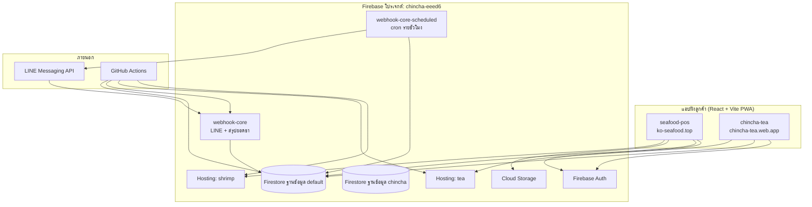

# สถาปัตยกรรม CHINCHA FLOW (`chincha-business-os`)

**CHINCHA FLOW** = ชื่อระบบรวม (แบรนด์) · **chincha-business-os** = ชื่อ monorepo ใน Git/npm · รายละเอียดชื่อและคำเรียกสากล → [CHINCHA_FLOW_NAMING_TH.md](./CHINCHA_FLOW_NAMING_TH.md)

เอกสารนี้อธิบายสถาปัตยกรรมของแพลตฟอร์มปฏิบัติการธุรกิจ (POS + สต๊อก + ลูกค้า + LINE) สองสายงาน: **โกอ้วน คลังซีฟู้ด** และ **ชินชา Tea POS** — ใช้ Firebase โปรเจกต์เดียว (`chincha-eeed6`) deploy แยก PWA คนละ Hosting target + Cloud Functions สำหรับ LINE

---

## ภาพรวมระดับสูง

---

## โครงสร้าง Repository

| Path | หน้าที่ |
|------|--------|
| `apps/seafood-pos` | POS กุ้ง — ขาย, สต๊อก FIFO, ลูกค้า, ออเดอร์จาก LINE |
| `apps/chincha-tea` | ร้านชา — บันทึกออเดอร์, สรุปยอด, เติมของ, แอดมิน, หลายภาษา |
| `apps/webhook-core` | Cloud Functions: LINE webhook + ส่งสรุปยอดชาด้วยมือ |
| `apps/webhook-core-scheduled` | สรุปยอดชาอัตโนมัติตามเวลา (codebase แยก) |
| `firestore.rules` / `firestore.indexes.json` | กฎความปลอดภัย + index ของฐานข้อมูล **(default)** |
| `firestore-chincha.rules` | กฎของฐานข้อมูล **`chincha`** (ข้อมูลเก่า) |
| `scripts/tea-db-reset.mjs` | สคริปต์เคลียร์ข้อมูลร้านชา (เก็บ `users` / `config`) |
| `.github/workflows/deploy.yml` | Deploy อัตโนมัติเมื่อ push ไป `main` |

**npm workspaces** ประกาศไว้ที่ `apps/*` และ `packages/*` แต่โฟลเดอร์ `packages/` ยังไม่มีใน repo (ระบุไว้ใน `docs/PROJECT_STRUCTURE.md` เป็นแผนในอนาคต) — โค้ดที่ใช้ร่วมกันตอนนี้อยู่ในแต่ละแอป เช่น รูปแบบ `firestoreRest.js`

---

## ชั้นข้อมูล: โปรเจกต์เดียว สองโดเมนธุรกิจ

แอปทั้งสองใช้ฐานข้อมูล Firestore **default** โดยแยก collection ตามธุรกิจ:

### ร้านชา (`chincha-tea`)

| Collection | ความหมาย |
|------------|----------|
| `teaOrders` | ยอดขายรายวัน (คีย์ `dateKey` ตามเวลาไทย) |
| `products`, `toppings` | เมนูและท็อปปิ้ง |
| `users` | โปรไฟล์พนักงาน (`approved`, `role`) |
| `restocks`, `dailyExpenses`, `dailyShopSummaries`, `dailyCupStocks`, `orderSlips` | เติมของ / ค่าใช้จ่าย / สรุปหน้าร้าน / สต๊อกแก้ว / สลิป (`dailyShopSummaries` เก็บเงินสด-โอน-จ่ายออก-แก้วขาย, `dailyCupStocks` เก็บแก้วคงเหลือยกวัน) |
| `config/teaLine` | ตั้งค่า LINE bot และสรุปอัตโนมัติ |

### กุ้ง (`seafood-pos`)

| Collection | ความหมาย |
|------------|----------|
| `sales` | บิลขาย (`dateKey`, รายการ, ประเภทชำระเงิน) |
| `shrimp_users` | ผู้ใช้กุ้ง (แยกจาก `users` ของชา) |
| `config/stock` | ยอดกุ้งเป็น/ตาย (อัปเดตแบบ real-time) |
| `stockBatches` | ล็อตรับเข้าแบบ FIFO |
| `customerDebts` | ลูกหนี้จากเครดิต/ผ่อน |
| `customers`, `productSettings/shrimp` | ลูกค้าและราคาสินค้า · `lineUserId` (billing) + `lineContacts[]` (billing/order หลาย UID ต่อร้าน) |
| `config/shrimpLine` | แจ้งเตือนออเดอร์ LINE + ช่วงเวลา「ไม่ระบุวันส่ง」(เริ่ม/สิ้นสุดรอบ ชม.) |
| `lineOrders` | ออเดอร์จาก LINE (วันส่ง, สถานะ) |
| `paymentSlipSubmissions` | คิวสลิปลูกค้ารอตรวจจาก LINE OA / LIFF / กลุ่มครอบครัวกุ้ง; รูปในกลุ่มจะบันทึกเฉพาะเมื่อผู้ส่งมีบริบทบิลค้างเปิดอยู่ เพื่อกันรูปทั่วไปถูกตอบรับเป็นสลิป |

นอกจากนี้มีฐานข้อมูลชื่อ **`chincha`** (กฎใน `firestore-chincha.rules`) สำหรับข้อมูลรูปแบบเก่า — สคริปต์ `tea:db-reset` สามารถล้างฐานนี้ได้เมื่อข้อมูลค้าง

กฎใน `firestore.rules` บังคับ **ต้องได้รับอนุมัติ** (`approved: true`) และแยกสิทธิ **admin** ตามธุรกิจ ส่วนอื่นๆ ถูก deny โดยค่าเริ่มต้น; `dailyExpenses` ให้ผู้สร้างรายการแก้ไขรายการของตัวเองได้เมื่อมี `createdByUid`, รายการ `entryMode=dailySummary` แก้ได้โดยผู้ใช้ที่อนุมัติแล้ว, และแอดมินลบได้; `dailyShopSummaries`/`dailyCupStocks` ให้พนักงานที่อนุมัติแล้วบันทึกงานหน้าร้านได้

---

## สถาปัตยกรรมฝั่ง Frontend

### เทคโนโลยีร่วม

- **React 18 + Vite** — ออกแบบมือถือเป็นหลัก (`max-w-md`), มี PWA manifest
- **Firebase Auth** (อีเมล/รหัสผ่าน) + อ่านเอกสารโปรไฟล์ก่อนเข้าใช้งานเต็มรูปแบบ
- **เข้าถึง Firestore แบบผสม**: SDK (`onSnapshot`, `setDoc`) และ **REST API v1** ใน `firestoreRest.js` (ควบคุม timeout, POST/PATCH)

### `seafood-pos` — โครงสร้างแบบ monolith

โค้ดหลักอยู่ใน `main.jsx` ไฟล์เดียว (~1,500 บรรทัด): ล็อกอิน, POS, แดชบอร์ด, สต๊อก, ออเดอร์ LINE, หน้าแอดมิน, แถบนำทางล่าง

ความสามารถเด่น:

- POS พร้อม numpad, ตะกร้า, ชำระเงินหลายแบบ (เงินสด / โอน / เครดิต / ผ่อน)
- **สั่งด้วยเสียง** ผ่าน Web Speech API (`useVoice`, `voiceParse.js`) — ภาษาไทยเกี่ยวกับกุ้ง → ตะกร้าหรือบันทึกอัตโนมัติ
- ตรวจสต๊อกก่อนขาย (ขายเกินกุ้งเป็น/ตายใน `config/stock` ไม่ได้)
- แดชบอร์ดรวมยอดขาย, ลูกหนี้, ล็อต FIFO (`salesAggregate.js`)

### `chincha-tea` — แยกเป็นแท็บ/คอมโพเนนต์

แบ่งเป็น `OrderTab`, `SummaryTab`, `RestockTab`, `AdminPanel` ฯลฯ

ความสามารถเด่น:

- **3 ภาษา** (ไทย / พม่า / อังกฤษ) ผ่าน `i18n.js`
- รองรับพนักงานพม่า (`burmeseLexicon.js`, `burmeseToThai.js`, `voiceOrder.js`)
- โหลดเมนูผ่าน `useCatalog`
- แอดมินส่งสรุป LINE จากแอป (เรียกฟังก์ชัน `teaPushSummary`)

---

## Backend: Cloud Functions + LINE

`apps/webhook-core` (Node 20, region `asia-southeast1`):

| ฟังก์ชัน | หน้าที่ |
|---------|--------|
| `lineWebhook` | บอท LINE กุ้ง — entrypoint เดิมสำหรับ LINE Console; ทำแค่ verify signature, dedup event พื้นฐาน แล้วส่งเข้า router แยก direct/group |
| `lineWebhookTea` | บอท LINE ชา — คำสั่ง `สรุป` / `help` (ไม่รับออเดอร์ลูกค้า) |
| `teaPushSummary` | HTTP POST สำหรับแอดมิน — ส่งสรุปยอดวันนั้นไปกลุ่ม LINE ที่ตั้งไว้ |

LINE กุ้งแยกบริบทใน `apps/webhook-core/src/` ดังนี้:

- `index.js` export Cloud Function ชื่อเดิม `lineWebhook` เพื่อไม่ต้องเปลี่ยน LINE Console/secret/deploy config และคุมเฉพาะ signature, loop events, redelivery/dedup (`webhookDedup`)
- `shrimpLineWebhookRouter.js` อ่าน `event.source.type`, `groupId`, `roomId` แล้ว route เป็น `direct` หรือ `group`
- `shrimpDirectLineWebhook.js` รวม flow แชตตรง LINE OA: follow welcome, รูปสลิป direct, help, LIFF order form, cancel, ข้อความสั่งกุ้ง และผูก UID ลูกค้า
- `shrimpGroupLineWebhook.js` รวม flow กลุ่ม/room: รูปสลิปต้องผ่าน guard กลุ่ม (ต้องเป็นกลุ่มที่อนุญาต + มีบิลค้างเปิด), คำสั่ง `summary`/`today_orders`, และข้อความสั่งกุ้งในกลุ่ม; ไม่ตอบ help/LIFF/cancel แบบแชตตรงเพื่อไม่รบกวนบทสนทนากลุ่ม

`apps/webhook-core-scheduled`:

| ฟังก์ชัน | หน้าที่ |
|---------|--------|
| `teaDailyScheduledSummary` | cron ทุกชั่วโมง; ถึงชั่วโมงที่ตั้ง (ค่าเริ่มต้น 22:00 กรุงเทพ) จะส่งสรุปชาถ้าเปิดใน `config/teaLine` |

 logic ร่วมอยู่ใน `teaDailySummary.js` (สร้างข้อความสรุปจาก `teaOrders`, ส่งข้อความ LINE)

ค่า LINE ใส่ตอน deploy ผ่าน GitHub Actions ลง `apps/webhook-core/.env`

---

## Deploy และการดูแลระบบ

เมื่อ **push ไป `main`** ไฟล์ `.github/workflows/deploy.yml` จะรันงานคู่ขนาน:

1. Deploy กฎและ index ของ Firestore (+ กฎ DB `chincha` ผ่าน Admin SDK)
2. Deploy Cloud Functions (+ ตรวจสุขภาพ webhook)
3. Build และ deploy Hosting **กุ้ง**
4. Build และ deploy Hosting **ชา** (job ชามี `continue-on-error: true`)

ตอน build ใช้ secrets `VITE_FIREBASE_*` และ `VITE_FIREBASE_APP_ID` แยกตามแอป

**งานด้วยมือ:**

- `npm run tea:db-reset:*` หรือ GitHub Actions **Tea DB Reset** เมื่อข้อมูลชาค้าง
- `deploy-functions-only.yml` สำหรับ deploy เฉพาะ functions

URL ที่ใช้งาน (จาก `docs/CLOUD_STATUS.md`):

- ชา: https://chincha-tea.web.app
- กุ้ง: https://ko-seafood.top

---

## แบบแผนที่ใช้ร่วมกันทั้งระบบ

1. **`dateKey` ตามเวลา Asia/Bangkok** — รายงานและ query รายวันอิงปฏิทินไทย ไม่ใช่เที่ยงคืน UTC
2. **ลงทะเบียนพนักงาน** — สมัคร → `approved: false` → แอดมินอนุมัติในแอป (ผู้ใช้กุ้งคนแรกหรืออีเมลแอดมินที่กำหนดอาจได้สิทธิทันที)
3. **LINE รับออเดอร์เฉพาะกุ้ง** — ชาใช้ LINE แจ้งสรุป/คำสั่ง; ยอดขายชาบันทึกใน PWA
4. **แยก collection ผู้ใช้** — `users` (ชา) กับ `shrimp_users` (กุ้ง), Hosting คนละ target, LINE คนละช่อง แต่กฎ Firestore ไฟล์เดียวครอบคลุมทั้งคู่
5. **เอกสาร vs โค้ดจริง** — `PROJECT_STRUCTURE.md` กล่าวถึง `packages/firebase`, `shared-ui`, `utils` ยังเป็นแผน ยังไม่ได้ implement

---

## สรุปแนวคิด

จัดเป็น **แพลตฟอร์มปฏิบัติการเดียว** (Firebase + CI) ที่มี **สองผลิตภัณฑ์บนหน้าจอ**:

- **กุ้ง** = POS เน้นสต๊อก + ลูกหนี้ + กล่องออเดอร์จาก LINE
- **ชา** = บันทึกยอดขายง่าย + UX หลายภาษาสำหรับพนักงาน + สรุปปิดวันผ่าน LINE

สิ่งที่เชื่อมทั้งสองคือโครงสร้างพื้นฐานร่วม (โปรเจกต์ Auth, Firestore default, pipeline deploy) มากกว่าแพ็กเกจ React ร่วม — ณ ตอนนี้

---

## เอกสารที่เกี่ยวข้อง

- [PROJECT_STRUCTURE.md](./PROJECT_STRUCTURE.md) — โครงสร้างโฟลเดอร์และ stack
- [CLOUD_STATUS.md](./CLOUD_STATUS.md) — สถานะบนคลาวและ URL
- [ENABLE_CLOUD_SCHEDULER.md](./ENABLE_CLOUD_SCHEDULER.md) — เปิด scheduler สรุปชาอัตโนมัติ
