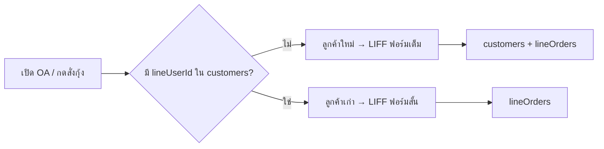
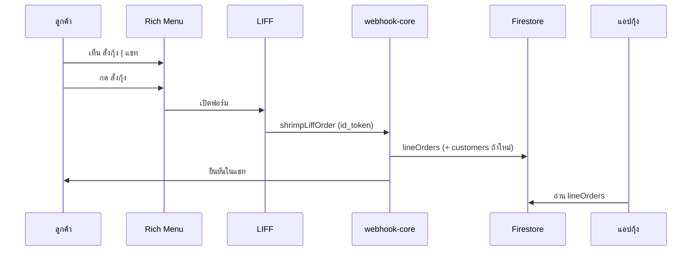

# สโคปงาน LINE OA — สั่งกุ้งโกอ้วน (seafood-pos)

เอกสารรวมไอเดียจากทีม (Peach) + แนวทางเทคนิคที่แนะนำ — **โฟกัสแชทตรง LINE Official Account เท่านั้น** ไม่รวมกลุ่ม LINE ในรอบนี้ (คนในบ้านรู้ระบบพิมพ์/บอร์ดแอปอยู่แล้ว)

**สถานะ:** LIFF MVP ในโค้ดแล้ว — ต้องตั้ง `LINE_LIFF_ID` + `VITE_LIFF_ID` + Rich Menu แล้ว deploy  
**ตั้งค่า:** `docs/LINE_LIFF_SETUP_TH.md`  
**อัปเดตล่าสุด:** ฟอร์มสองภาษา · submit → `lineOrders` · กลุ่ม LINE ไม่เปลี่ยน

---

## เป้าหมายสุดท้าย (ผลลัพธ์ที่เห็นได้)

| ฝั่ง | ผลลัพธ์ |
|------|---------|
| **ลูกค้า (LINE OA)** | เปิดแชท → เห็น **Rich Menu** ถาวร (สั่งกุ้ง · แชท) → กดสั่งกุ้ง → **LIFF** ฟอร์มสั่ง · หรือแชทพิมพ์เอง |
| **ร้าน (แอปกุ้ง)** | ออเดอร์ขึ้นบอร์ด LINE / รอส่ง · ชื่อร้านจากรายชื่อแอป (ไม่สะกดผิด) |
| **ลูกค้าใหม่** | ฟอร์มเต็ม: ชื่อ / เบอร์ / จุดส่ง → บันทึก `customers` + `lineUserId` + สั่งได้ |
| **ลูกค้าเก่า** | ฟอร์มสั้น: เล็ก·กลาง·ใหญ่ · ตาย · numpad น้ำหนัก · วันนี้/วันอื่น |

**ไม่รวมในงานนี้:** สติกเกอร์ทุกประเภท (อธิบายด้านล่าง)

---

## สติกเกอร์ — แยกประเด็น (ไม่งานชุดนี้)

เคยคุยกันหลายความหมาย — **งาน LINE OA รอบนี้ไม่ทำทั้งหมด**

| ความหมายที่เคยพูดถึง | ตัวอย่าง | งานนี้ |
|---------------------|---------|--------|
| **สติกติดกล่อง / รหัสส่งของ** | สติกกระดาษเลข 4 ติดกล่องเจ๊เขียด · พิมพ์ `4️⃣` ในแชทสับกับน้ำหนัก | **ไม่ทำ** — จัดส่งใช้กระบวนการเดิมนอกระบบ |
| **ข้อความ/emoji ในแชท** | ลูกค้าพิมพ์ `4️⃣กก` · เลข 4 หลังชื่อ | **ไม่ parse เป็นสติก** — ใช้ LIFF/numpad หรือตัวเลข+กก. เป็นน้ำหนักอย่างเดียว |
| **สติกเกอร์ LINE (สติกแพ็ก)** | ลูกค้ากดส่ง Sticker การ์ตูนในแชท | **ไม่รับเป็นคำสั่ง** — ไม่สนใจทั้งส่งให้เขาและรับจากเขา |
| **ช่องบนฟอร์ม LIFF** | ช่อง「เลขสติก」ในแอปสั่ง | **ไม่มีในฟอร์ม** |
| **ฟิลด์ในแอปจัดการลูกค้า** | `defaultStickerNo` ใน Firestore | **ไม่เพิ่มในรอบนี้** |

สรุป: **ไม่ใช่แค่สติกในแชทอย่างเดียว** — รวมถึง **ไม่ใส่ช่องสติกบนฟอร์ม** และ **ไม่โชว์บนบอร์ด**

---

## Rich Menu vs LIFF (ตอบคำถาม “แถบถาวร”)

| สิ่งที่เห็น | เทคโนโลยี | เมื่อไหร่ |
|-----------|-----------|----------|
| แถบล่าง **สั่งกุ้ง \| แชท** | **Rich Menu** | ตลอดเวลาในแชท OA (ลูกค้าเดิมและใหม่เหมือนกัน) |
| ฟอร์มเล็ก/กลาง/ใหญ่ · ตาย · numpad · วันส่ง | **LIFF** | เฉพาะตอนกด「สั่งกุ้ง」 |

**ไม่ใช่** “LINE list” · **ไม่ใช่** Rich Menu = ฟอร์ม

```
เปิด OA → Rich Menu [ สั่งกุ้ง | แชท ]
              │
    กดสั่งกุ้ง ─┴─► เปิด LIFF (ฟอร์ม)
    กดแชท / พิมพ์ในช่อง ─► ข้อความปกติ (webhook parse เดิม)
```

---

## ขอบเขต (In scope / Out of scope)

### In scope — รอบ LINE OA

- Rich Menu ถาวร: **สั่งกุ้ง** · **แชท** (หรือช่วยเหลือ — ตามที่ออกแบบสุดท้าย)
- LIFF ฟอร์มสั้น (ลูกค้าเก่า) / ฟอร์มเต็ม (ลูกค้าใหม่)
- Webhook รับข้อความพิมพ์ (`เฟิร์ส 2 โล`, `ปุ้ย 2`) คู่ขนาน
- `lineOrders` + บอร์ด `LineOrdersScreen`
- `customers.lineUserId` ↔ LINE UID
- ชื่อร้านจากแอปเมื่อผูกแล้ว

### Out of scope — รอบนี้

- กลุ่ม LINE
- ลูกค้าใหม่ตั้ง **default ไซซ์** วันแรก
- จัดอันดับลูกค้าประจำตอนของไม่พอ / แดชบอร์ดพฤติกรรมไซซ์
- **สติกเกอร์ทุกแบบ** (แชท · ฟอร์ม · บอร์ด · โปรไฟล์)

---

## นิยามลูกค้า



| | ลูกค้าใหม่ | ลูกค้าเก่า |
|---|-----------|------------|
| เงื่อนไข | ยังไม่ผูก LINE ในแอป | ผูกแล้ว |
| LIFF | ชื่อ · เบอร์ · จุดส่ง + สั่ง | ชื่อจากแอป · ไซซ์ · ตาย · น้ำหนัก · วันส่ง |
| default ไซซ์ | **ไม่บังคับตั้ง** | เลือก เล็ก/กลาง/ใหญ่ อิสระทุกครั้ง |

---

## ออกแบบฟอร์ม LIFF (ตัวอย่าง — มาตรฐานสากล)

หลักที่ใช้: มือถือก่อน · ปุ่มสัมผัส ≥ 48px · คอนทราสต์ชัด · ลำดับข้อมูลชัด · ปุ่มหลักติดล่าง (sticky) · safe-area iOS · ฟอนต์ Sarabun · โทนมั่นคง (slate + sky)

**สองภาษา (ไทย + อังกฤษ):** ข้อความหลักเป็นภาษาไทย · อังกฤษบรรทัดล่างตัวเล็ก (`text-[10px]`) หรือในวงเล็บถัดจากปุ่ม — ไฟล์ `apps/seafood-pos/src/liff/liffCopy.js` · คอมโพเนนต์ `Bilingual.jsx`

**ดูตัวอย่างในเบราว์เซอร์ (ยังไม่เชื่อม LINE):**

```bash
npm run dev:seafood
# เปิด http://localhost:5173/liff-order.html
# ลูกค้าเดิม (ค่าเริ่มต้น) · ลูกค้าใหม่: ?mode=new
```

ไฟล์: `apps/seafood-pos/src/liff/LineOrderLiffApp.jsx` · entry `liff-order.html`

| องค์ประกอบ | รายละเอียด |
|------------|------------|
| Header | ชื่อร้านจากแอป · สถานะเชื่อมต่อ · ข้อความใส่ใจสั้นๆ |
| กุ้งเป็น | การ์ดเลือก เล็ก/กลาง/ใหญ่ — เปิดแล้วแสดง numpad ในการ์ด |
| กุ้งตาย | สวิตช์เปิด/ปิด + numpad |
| วันส่ง | Segmented วันนี้ / วันอื่น + date picker |
| สรุป | แถบสรุปออเดอร์ด้านบน (อัปเดตทันที) |
| ล่าง | ปิด · ยืนยันสั่งกุ้ง (ปุ่มหลักเดียว) |
| ลูกค้าใหม่ | ขั้น 1 โปรไฟล์ → ขั้น 2 ฟอร์มสั่งเหมือนเดิม |

---

## ประสบการณ์ลูกค้า (UX)

### 1) Rich Menu — แถบถาวร (ลูกค้าเดิม = เหมือนใหม่)

| ช่อง | ป้าย | การทำงาน |
|------|------|----------|
| 1 | **สั่งกุ้ง** | เปิด LIFF |
| 2 | **แชท** | โฟกัสช่องพิมพ์ / ข้อความช่วยเหลือสั้น (ไม่เปิดฟอร์ม) |
| 3+ | ช่วยเหลือ / ว่าง | ตามทีม |

### 2) LIFF — ฟอร์มสั้น (ลูกค้าเก่า)

- ชื่อร้าน (จากแอป)
- กุ้งเป็น: เล็ก · กลาง · ใหญ่ (หลายรายการได้)
- กุ้งตาย: ติ๊ก + น้ำหนัก
- **Numpad** น้ำหนัก (กก.)
- วันส่ง: วันนี้ / วันอื่น
- ปุ่ม: ส่งออเดอร์ · ปิด (กลับแชท)

**ไม่มี** ช่องสติกเกอร์

### 3) LIFF — ฟอร์มเต็ม (ลูกค้าใหม่)

- ชื่อร้าน · เบอร์ · จุดส่ง/notes
- บล็อกสั่งเหมือนฟอร์มสั้น
- ไม่มี default ไซซ์ · ไม่มีช่องสติก

### 4) แชท (พิมพ์เอง)

- `เฟิร์ส 2 โล` → webhook → `lineOrders`
- ลูกค้าผูกแล้ว → ชื่อจากแอป

---

## สถาปัตยกรรม (ย่อ)



### Firestore (รอบนี้)

| Field | ใช้ |
|-------|-----|
| `customers.lineUserId` | แยกใหม่/เก่า |
| `customers.defaultRiverSize` | มีได้จากร้านที่ฟิกมือแล้ว — ไม่บังคับลูกค้าใหม่ |
| `lineOrders` | เหมือนเดิม · อาจเพิ่ม `source: 'liff'` |
| ~~`defaultStickerNo`~~ | **ไม่ทำรอบนี้** |
| ~~`stickerNo`~~ | **ไม่ทำรอบนี้** |

---

## แบ่งเฟส

### เฟส 0 (เล็ก)

- [ ] ชื่อร้านจากแอปเมื่อผูก LINE (webhook + บอร์ด)

### เฟส 1 — MVP LINE OA

- [x] LIFF ฟอร์ม (`liff-order.html`) + `shrimpLiffOrder` function
- [ ] Rich Menu ใน LINE Console (สั่งกุ้ง · แชท) — ทีมตั้ง
- [x] ฟอร์มสั้น / เลือกรายชื่อ / ลูกค้าใหม่ (ไม่มีสติก) · สองภาษา
- [x] Submit → `lineOrders` (`source: liff`) + push ยืนยันแชท

### เฟส 2+

- [ ] Quick Reply · E2E ร้านจริง
- [ ] พฤติกรรมไซซ์ / เทกแคร์ตอนสต๊อกไม่พอ

---

## เกณฑ์รับงาน

1. ลูกค้าเก่า: Rich Menu → สั่งกุ้ง → เล็ก 4 กก. + ตาย 2 กก. วันนี้ → บอร์ดถูก  
2. ลูกค้าใหม่: ฟอร์มเต็ม → รายชื่อแอป + ออเดอร์  
3. กดแชท/ปิด LIFF → พิมพ์ `เฟิร์ส 2 โล` ได้  
4. **ไม่มี** UI/ฟิลด์/บอร์ดเกี่ยวกับสติกเกอร์  
5. กลุ่ม LINE ไม่ regression  

---

## สรุปหนึ่งย่อหน้า

**ผลสุดท้าย:** OA มี Rich Menu **สั่งกุ้ง | แชท** → LIFF สั่งด้วยไซซ์+numpad+วันส่ง (ใหม่=ฟอร์มเต็ม, เก่า=ฟอร์มสั้น) · แชทพิมพ์ได้ · บอร์ดแอปรับออเดอร์ · **ไม่ยุ่งสติกเกอร์** (ไม่ว่าในแชท บนฟอร์ม หรือสติก LINE)

---

*อัปเดตจาก #chincha-shrimp-agent — ยังไม่ merge จนกว่าทีมสั่ง implement*
